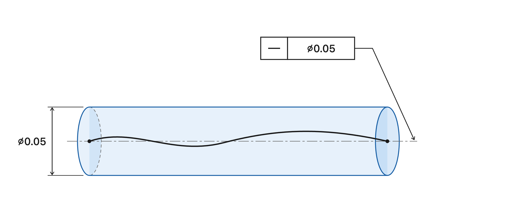

# formal-gdt

A Lean 4 + Mathlib formalisation of the definitions in
**ASME Y14.5.1**.

Every definition is stated against an exact quote taken from the standard
(see [`Y14.5.1-definitions.md`](Y14.5.1-definitions.md)), then proved to
have the same properties as claimed in the standard.

Sections of Y14.5.1 covered: `<FILL THIS IN §§>`. The project is sorry-free.


## Background

GD&T has been used by engineers and manufacturers for over 85 years. It's a precise, standardized symbolic language for communicating how much a manufactured part is allowed to vary from its original, intended design.

For example, you might annotate a line in your design with the following GD&T:

```
│ ─ │ Ø 0.05 │
```

This means that the indicated surface line element must lie within a straightness zone with tolerance 0.05.



Note: The units, here aren't specified by the GD&T symbol itself. They are chosen by the engineer when drawing the design. All geometric definitions underlying these requirements are described rigorously (but not formally) in ASME Y14.5.1.

For example, Y14.5.1 defines the straightness zone for a derived median line as a cylindrical zone whose diameter is the specified tolerance.

## So why formalise GD&T?

There are a few reasons.

- The underlying mathematics is already precise.
- GD&T involves many, many interacting geometric definitions which are hard to keep track of.
- The mathematics is difficult to read and verify manually.

Formalisation gives us a way to turn these definitions into objects and propositions that can be checked mechanically.

## Project

I formalise the main definitions, "theorems", and best practices of ASME Y14.5 using Lean. (I've extracted the formalised sections and put them in Y14.5.1-definitions.md)

I put "theorems" in quotes here because we don't really have theorems, we have mathematical practices that engineers must follow.

For example, one simple mathematical practice is the fastener formula which tells you the maximum positional tolerance (T) you're allowed to give to a hole when using a fastener (screw, bolt, nut, washer, etc.).

```
T = H - F
```

Where H = diameter of the hole and F = diameter of the fastener.

By formalising in Lean, we're able to show formally, under what cases, this formula holds and when it doesn't.


## In Context

This repo is part of a larger aim to make engineering compliance machine-checkable by formalising engineering standards and tools in Lean 4. 
